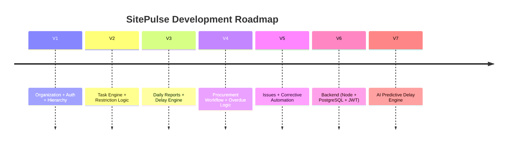

<div align="center">

# 🏗️ SitePulse — Industrial Construction Management Platform

[]()
[](https://nextjs.org)
[](https://www.typescriptlang.org)
[](https://zustand-demo.pmnd.rs/)
[]()

*A structured industrial execution management platform for Oil & Gas, Infrastructure, and Construction Projects.*

[Overview](#-overview) • [Architecture](#-architecture) • [Quick Start](#-quick-start) • [Modules](#-core-modules) • [Roadmap](#-roadmap)

</div>

---

## 📋 Table of Contents

- [Overview](#-overview)
- [Architecture](#-architecture)
- [Technology Stack](#-technology-stack)
- [Core Modules](#-core-modules)
- [Quick Start](#-quick-start)
- [Project Structure](#-project-structure)
- [Roadmap](#-roadmap)
- [Design Principles](#-design-principles)
- [License](#-license)

---

## 🎯 Overview

**SitePulse** is a mobile-first construction execution management system designed for:

- Oil & Gas Projects  
- Infrastructure  
- Large-scale Industrial Construction  

### Problem Statement

Industrial projects suffer from:

- ❌ Informal communication (WhatsApp chaos)
- ❌ Unstructured task delegation
- ❌ No hierarchical enforcement
- ❌ Poor procurement visibility
- ❌ Delayed quality corrective actions
- ❌ No real-time execution tracking

### SitePulse Solution

✔ Structured hierarchical delegation  
✔ Punch list task management  
✔ Daily production tracking  
✔ Procurement workflow control  
✔ Quality inspection automation  
✔ Overdue detection engine  
✔ Cross-department coordination  

---

## 🏗️ Architecture

### System Overview

```mermaid
graph TB
    A[User Authentication]
    B[Organization Hierarchy Engine]
    C[Task Module]
    D[Daily Reports]
    E[Procurement Workflow]
    F[Issues Engine]
    G[Quality Module]
    H[Dashboard]

    A --> B
    B --> C
    C --> D
    D --> E
    C --> F
    F --> G
    G --> H
    E --> H
    D --> H
````

---

### Hierarchy Logic (Core Engine)

```mermaid
graph TD
    PM[Project Manager]
    CM[Construction Manager]
    SUP[Supervisor]
    FOR[Foreman]
    WRK[Worker]

    PM --> CM
    CM --> SUP
    SUP --> FOR
    FOR --> WRK
```

Assignment is strictly restricted by hierarchy:

> A user can assign tasks only to themselves or to users within their reporting chain.

---

## 🛠️ Technology Stack

| Layer        | Technology         | Purpose                      |
| ------------ | ------------------ | ---------------------------- |
| Frontend     | Next.js 16         | App Router, SSR, routing     |
| Language     | TypeScript         | Strict typing                |
| State        | Zustand + Persist  | Global state + Local storage |
| Styling      | TailwindCSS        | Industrial UI                |
| Auth         | Local state (MVP)  | Future JWT ready             |
| Storage      | LocalStorage       | Backendless MVP              |
| Architecture | Modular App Router | Clean separation             |

---

## 🧩 Core Modules

### 1️⃣ Organization Module

* Hierarchical reporting structure
* Role-based color coding
* Multi-level tree rendering
* Department filtering
* Search functionality
* `canAssign()` logic enforcement

---

### 2️⃣ Task Management (Punch List)

* Create / Assign tasks
* Due date
* Priority
* Status tracking
* Parent-child subtasks
* Activity tracking
* Hierarchy-restricted assignment

---

### 3️⃣ Daily Reports

* Target vs Actual quantity
* Delay reasons mandatory if underperformance
* Category-based delay tracking
* Production monitoring

---

### 4️⃣ Procurement Module

Workflow:

```
Draft → Submitted → Approved → Ordered → Delivered
```

Overdue logic:

```
If Today > Needed By
AND status ≠ Delivered
→ Mark as Overdue
```

---

### 5️⃣ Issues Module

Workflow:

```
Open → In Progress → Blocked → Closed
```

Overdue detection engine included.

---

### 6️⃣ Quality Module

Inspection logic:

* Checklist (Pass / Fail / NA)
* If any Fail → Inspection = FAIL
* Auto-create corrective Issue
* Linked bidirectionally

---

## 🚀 Quick Start

### Prerequisites

```bash
Node.js >= 18
npm >= 9
```

---

### Installation

```bash
git clone https://github.com/your-username/sitepulse.git
cd sitepulse
npm install
npm run dev
```

Open:

```
http://localhost:3000
```

---

## 📁 Project Structure

```
sitepulse/
├── app/
│   ├── dashboard/
│   ├── login/
│   ├── register/
│   ├── organization/
│   ├── tasks/
│   └── layout.tsx
├── store/
│   ├── useUserStore.ts
│   ├── useTaskStore.ts
├── types/
│   ├── user.ts
│   ├── task.ts
├── lib/
│   └── hierarchy.ts
├── public/
├── package.json
└── README.md
```

---

## 🗺️ Roadmap



---

## 🧠 Design Principles

* Industrial workflow first, UI second
* Hierarchy enforcement mandatory
* Validation rules strict
* Clean modular architecture
* Mobile-first
* Minimal clutter
* Structured execution logic
* MVP first, backend later

---

## 🔐 Security Note (MVP)

Current version uses:

* Local state persistence
* No encryption
* No JWT

Future version:

* Backend API
* Role-based access control (RBAC)
* JWT Authentication
* Audit trail logging

---

## 👤 Author

**Linda Jerbi**
Software Engineering Student
Tunisia 🇹🇳
2026

---

<div align="center">

⬆ Back to Top

Built for real industrial execution.

</div>